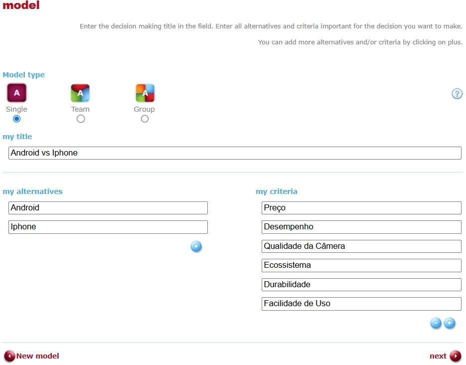
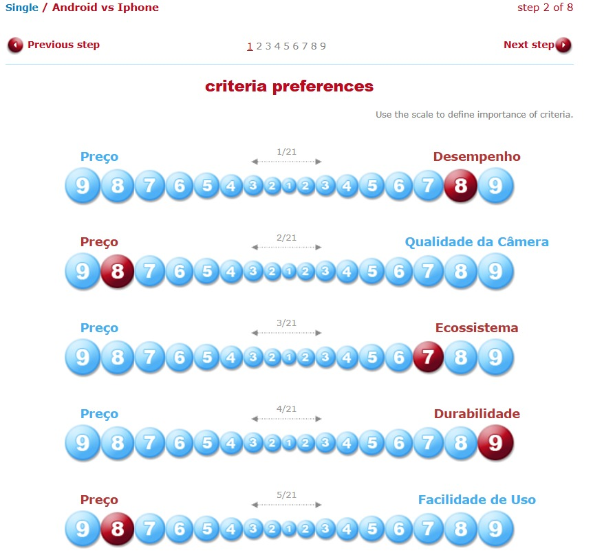
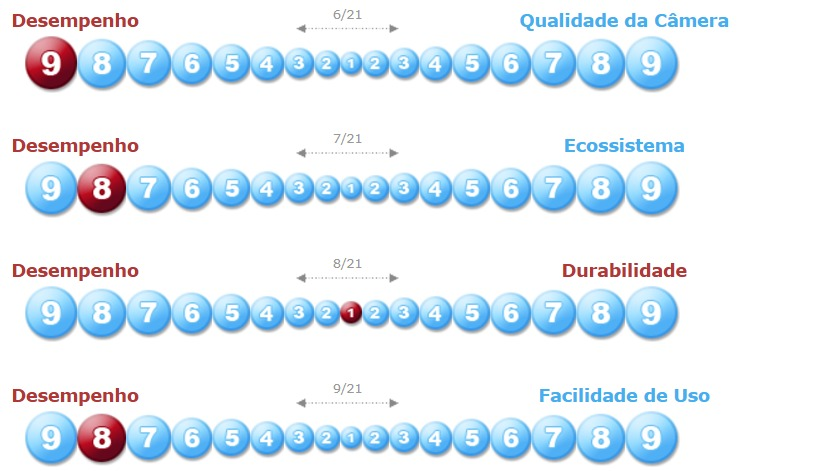
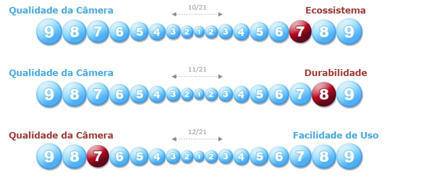
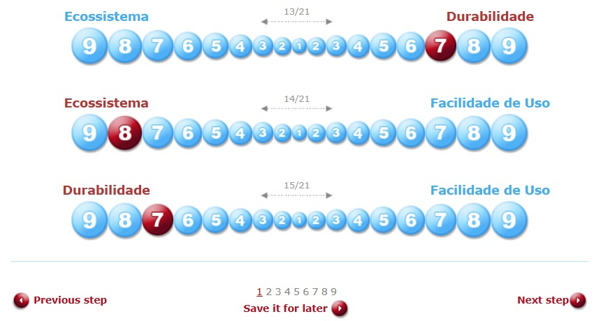
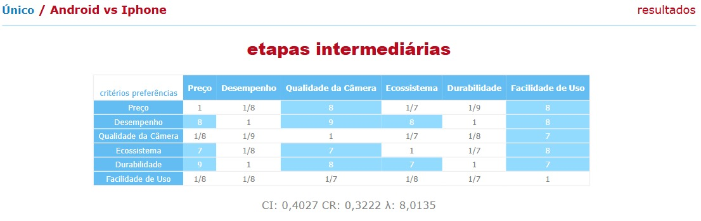
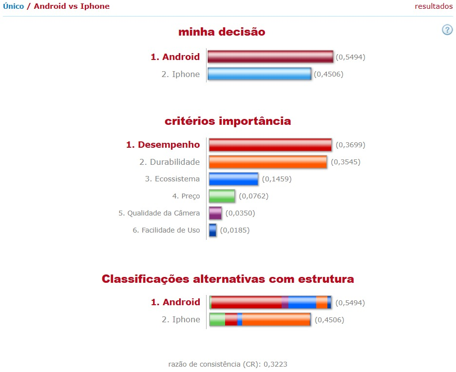

# Implementação do Método AHP

## Introdução
O método AHP (Analytic Hierarchy Process) é uma técnica de apoio à decisão que auxilia na escolha entre alternativas, utilizando critérios ponderados. Este documento reúne capturas de tela da implementação do método AHP para o problema de decisão **Android x iPhone** na plataforma [123ahp](http://www.123ahp.com/Izracun.aspx).

---

## Estrutura do Documento
As seções a seguir organizam as capturas de tela obtidas durante o processo.

### 1. Configuração do Problema
- Objetivo: Escolher o melhor smartphone.
- Alternativas: Android, iPhone.
- Critérios: Preço, Desempenho, Qualidade da Câmera, Ecossistema, Durabilidade, Facilidade de Uso.

**Print da configuração do problema:**  

---

### 2. Comparação das Alternativas por Critério
As alternativas (Android e iPhone) são comparadas para cada critério.  

**Prints das matrizes de comparação por critério:**   
    

    

    

    

---

### 3. Matriz de Comparação dos Critérios

Os critérios são comparados entre si e as alternativas são avaliadas em relação a cada critério. As comparações utilizam uma escala de 1 a 9 (Escala de Saaty):

| Intensidade | Definição                                          |
|-------------|----------------------------------------------------|
| 1           | Importância igual                                  |
| 3           | Importância moderada                               |
| 5           | Importância forte                                  |
| 7           | Importância muito forte                            |
| 9           | Importância extrema                                |
| 2, 4, 6, 8  | Valores intermediários entre os valores adjacentes |

**Print da matriz de comparação:**  

---

### 4. Resultados e Priorização
O sistema apresenta os pesos calculados e a alternativa ideal com base na soma ponderada dos critérios.  

**Print dos resultados finais:**  

### Critérios mais relevantes:
1. **Desempenho (0,3699)** - Considerado o fator mais importante na decisão, onde Android demonstrou vantagem.
2. **Durabilidade (0,3545)** - Segundo critério mais relevante, novamente favorecendo Android.
3. **Ecossistema (0,1459)** - Apresentou impacto moderado na decisão, mas não foi determinante.

### Critérios com menor influência:
- **Preço (0,0762)**: Relevância baixa.
- **Qualidade da Câmera (0,0350)**: Influência mínima.
- **Facilidade de Uso (0,0185)**: Peso quase desprezível.

### Razão de Consistência (CR)
A análise apresenta uma **Razão de Consistência (CR)** de **0,3223**, indicando que os julgamentos têm um nível de consistência razoável, mas poderiam ser aprimorados.

---

## Conclusão

A análise realizada utilizando o método AHP revelou que a alternativa **Android** é a escolha para o problema de decisão, com uma pontuação de **0,5494**, em comparação com o **iPhone**, que obteve **0,4506**.

